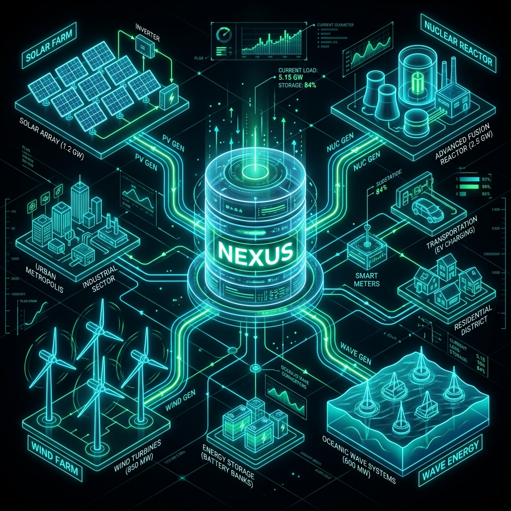

# ⚡️ NEXUS ENERGY PLATFORM ⚡️: The Ultimate Grid Vibe Check & Live Use Cases 🌍🔌

## 1. 🚀 TL;DR / Executive Summary
The Nexus Energy Platform is a top-tier 🥇 grid visualization software suite. Let's be real: old-school power grids are getting totally wrecked by wild, unpredictable renewable energy sources 🌪️☀️. Our platform does the heavy math 🧮 to bridge that gap, showing EXACTLY how the weather is messing with local power flow, and keeping the grid from straight-up crashing before the end-user even notices. 😎🔋

---

## 2. 🛠️ How It Actually Works & Problems We Crush 💥

### 🌩️ Issue A: Nature Hating Us (Grid Defection)
Normal grids literally die when nature decides to stop cooperating. 💀
* ☀️ **Solar collapse**: Flash storms block the sun? Boom, random power drop. 🌧️
* 💨 **Wind stagnation**: Wind just stops for days? Massive wind farms become useless metal trees. 🛑

**✨ The Nexus Fix:** By pinging live global weather APIs 🛰️ (checking out Cloud Cover and Surface Pressure vibes), our dashboard calculates the exact power drop-off locally. It feeds all that telemetry to our AI projection module 🧠, predicting failure times down to the literal MINUTE ⏱️. This lets local utilities casually spool up backup gas or nuclear reserves like a boss. 🏭🔥

### 📈 Issue B: Suffering From Success (Over-Generation Spikes)
Sometimes the weather is *too* good (like crazy hurricane winds + perfectly clear solar arrays somewhere else). 🌪️☀️ This hyper-generation physically overloads and deep-fries neighborhood transformers. 🍟🔥

**✨ The Nexus Fix:** Our custom *Grid Status Tracker* 📊 watches Net output limits like a hawk 🦅. The platform visually screams "Hyper-generation!" 🚨 when things get too spicy. When that triggers, it programmatically tells colossal battery banks 🔋 to switch from "Discharge" to "GIMME JUICE" (Active Charging mode), eating the excess electricity and saving the grid from a physical meltdown. 🧊💆‍♂️

---

## 3. 🏗️ The Four-Pillar Energy Matrix Design
We don't do basic dual-systems here. 🙅‍♂️ Our dashboard orchestrates and overlays four distinctly generated data sources all at once:

1.  ☀️ **Solar Array Simulator:** Super dynamic. Hooked straight into live geographic cloud-cover data. ☁️📡
2.  🌪️ **Kinetic Wind Farm:** Runs on some intense math (asymptotic curves, baby 🤓) relying on air density and wind speeds.
3.  🌊 **Hydro-Tidal Generation:** Simulating coastal wave converters and underwater tidal turbines. Big splash energy. 🐳🏄‍♂️
4.  ☢️ **Nuclear Baseload Reactors:** Providing that THICK, steady baseline power necessary to buffer the wild mood swings of natural renewables. 💪🔋

---

## 4. 🎨 UI/UX Vibes
The dashboard rocks a sick dark-glass aesthetic ('glassmorphism' 🪟✨) pushing buttery smooth SVG animations via Framer Motion. 🎥 The interface actively shape-shifts based on the grid's status across different global coordinates. 🌍 

Using the integrated *NEXUS Interactive Global Map* 🗺️, operators can pull live diagnostic stats from major hubs like London 🇬🇧, New York 🍎, and Mumbai 🇮🇳 with a single click. Or, just smash the *Locate Me* 📍 button to spin up a micro-grid right over your physical location. 🔥🤯
